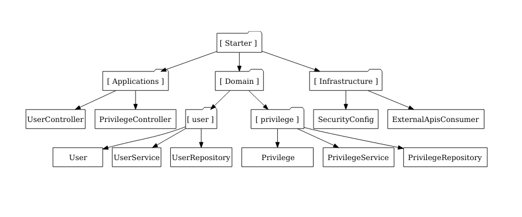

<h1 align="center">
  LabRat 🧪
</h1>

## 📌 Apresentação
LabRat é um sistema desenvolvido em **Spring Boot** que permite aos estudantes gerar quizzes automaticamente a partir de arquivos PDF enviados por professores, utilizando inteligência artificial para criar perguntas e respostas sobre temas específicos. O projeto implementa uma variação da **Arquitetura Limpa**, estruturando o sistema em três camadas principais: `Application`, `Domain` e `Infrastructure`.

## ✨ Funcionalidades
O LabRat oferece uma variedade de recursos para facilitar o aprendizado e a avaliação de conhecimento:

- **Geração de Quiz por Texto**: Insira um texto e gere automaticamente um quiz com perguntas e respostas.
- **Visualização e Edição de Quiz**: Visualize o quiz gerado, edite perguntas e respostas para corrigir erros da IA.
- **Resolução de Quiz**: Responda ao quiz e veja sua pontuação ao final.
- **Análise de Desempenho**: Visualize quais questões acertou ou errou.
- **Upload de Documentos**: Envie arquivos PDF ou DOCX para gerar quizzes automaticamente.
- **Processamento de Áudio**: Envie áudios para converter fala em texto e gerar quizzes.
- **Gerenciamento de Perguntas**: Adicione ou remova perguntas do quiz.
- **Salvamento e Histórico**: Salve quizzes para acesso posterior e visualize o histórico de quizzes realizados.
- **Acessibilidade por Voz**: Ouça perguntas e respostas, e responda usando voz.
- **Métricas de Desempenho**: Visualize métricas de desempenho ao longo do tempo.
- **Integração com IA**: Processamento inteligente de texto, conversão de áudio em texto, extração de texto de documentos e validação de qualidade das perguntas.

## 🏗️ Estrutura do Projeto
O projeto é organizado da seguinte forma:



### **1. Application**
Esta camada é responsável pela interação com os clientes da API e pela orquestração dos casos de uso. Contém:
- **`api`**: Pacote contendo todos os controllers e endpoints da API.
- **`useCase`**: Pacote que agrupa todos os casos de uso (regras de negócio que interagem com a camada `Domain`).

### **2. Domain**
Contém toda a lógica de negócio e entidades do sistema. Inclui:
- **Entidades**: Representação dos objetos de domínio (como Quiz, Pergunta, Resposta).
- **Services**: Implementação das regras de negócio independentes de frameworks.
- **Repositories**: Interface para abstração do acesso aos dados.

### **3. Infrastructure**
Gerencia as configurações e integrações externas, incluindo:
- **Configurações**: Propriedades do Spring Boot e beans necessários para a infraestrutura.
- **Conexões externas**: Integrações com APIs de IA, serviços de conversão de áudio e provedores de armazenamento.
- **Spring Security**: Configurações de autenticação e autorização para proteger a API.

## 🚀 Tecnologias Utilizadas
- **Java 17+**
- **Spring Boot** (Web, Data JPA, Security, etc.)
- **PostgreSQL / MySQL** (ou outro banco de dados relacional)
- **Flyway** (para controle de versionamento do banco de dados)
- **Docker** (opcional, para facilitar o deploy)
- **Integrações com IA** (para geração de perguntas e processamento de texto/áudio)

## 📥 Instalação e Configuração

### **1. Clonar o repositório**
```bash
    git clone https://github.com/usuario/labrat.git
    cd labrat
```

### **2. Configurar o Banco de Dados**
Atualize o arquivo `application.properties` (ou `application.yml`) com as credenciais do banco de dados:
```properties
spring.datasource.url=jdbc:postgresql://localhost:5432/labrat_db
spring.datasource.username=usuario
spring.datasource.password=senha
```

### **3. Executar o projeto**
```bash
./mvnw spring-boot:run
```
Ou, caso esteja usando Docker Compose:
```bash
docker-compose up -d
```

## 🤝 Contribuição
Se deseja contribuir com o projeto, siga estas etapas:
1. Faça um fork do repositório.
2. Crie uma branch com a feature desejada (`git checkout -b minha-feature`).
3. Faça commit das suas alterações (`git commit -m 'Adicionando nova funcionalidade'`).
4. Envie para o repositório (`git push origin minha-feature`).
5. Abra um Pull Request.

---

## 📜 Licença
Este projeto é licenciado sob a [MIT License](LICENSE).